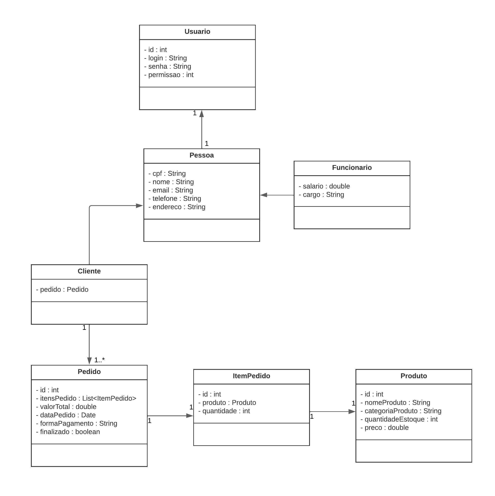

# Diagrama de Classes
## Versionamento
| Data | Versão | Descrição | Autor(es) |
|:----:|:------:|:---------:|:---------:|
| 14/07/2024 | 0.1 | Criação de documento | [Messias](https://github.com/messias003), [Bruna](https://github.com/BrunaSoug) |

## Definição

O diagrama de classes é uma ferramenta essencial para o desenvolvimento orientado a objetos, fornecendo uma maneira visual de representar a estrutura e as relações entre as classes de um sistema. Sua utilização facilita a comunicação entre desenvolvedores, a identificação de problemas de design e a documentação do sistema.

## Diagrama de Classes

##### *Versão 0.1*

## Referências

1. Documentação de diagramas UML, Diagrama de Classes. Disponível em: [uml-diagrams.org](https://www.uml-diagrams.org/class-diagrams-overview.html). Acesso em: 14/07/2024.
